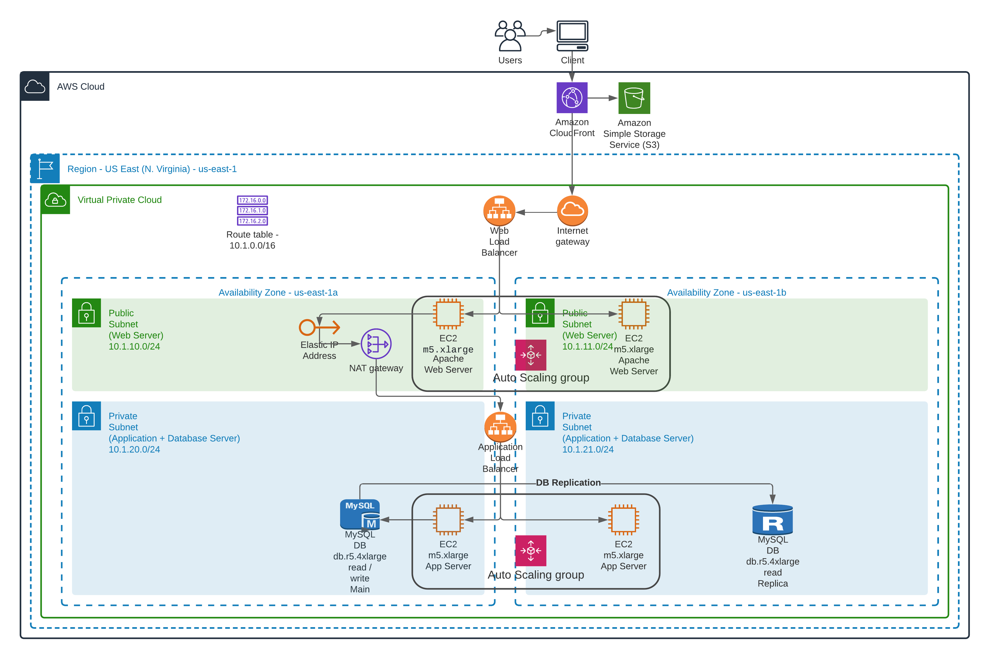
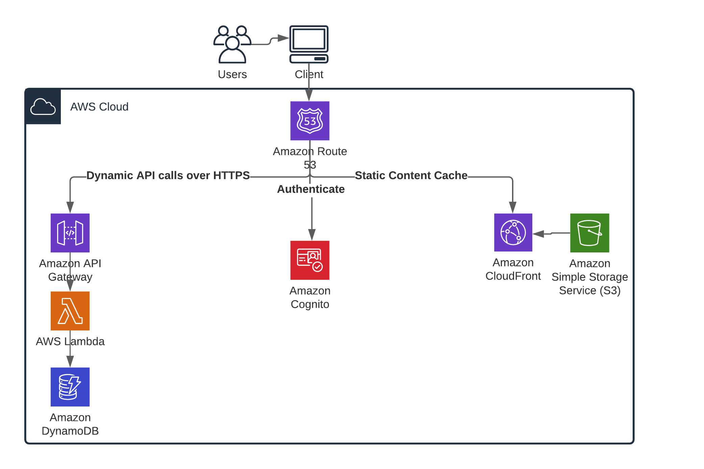

# Design for Performance and Scalability in AWS

---

## Project 2 of 3 in AWS Cloud Architect Nanodegree at Udacity

---

### Part 1 - Design Infrastructure Solution

#### 1.1. Criteria

- Develop a schematic for the application development project.

#### Meets Specification

- The infrastructure includes:

  - Infrastructure in the following regions: us-east-1
  - Users and Client machines
  - One VPC
  - Two Availability Zones
  - Four Subnets (2 Public, 2 Private)
  - A NAT Gateway
  - A CloudFront distribution with an S3 Bucket
  - Web servers in the Public Subnets
  - Application Servers in the Private Subnets
  - DB Servers in the Private Subnets
  - Web Servers Load Balanced and Autoscaled
  - Application Servers Load Balanced and Autoscaled
  - A Master DB in AZ 1 with a read replica in AZ2

- All services in the diagram include a label to indicate the type of service and any necessary parameters (e.g. size, location).

- Visible lines represent all network connections.
  - 

#### 1.2. Criteria

- Develop a schematic for a Serverless AWS infrastructure application development project.

#### Meets Specification

- The infrastructure includes:

  - A user and client machine
  - AWS Route 53
  - A CloudFront Distribution
  - AWS Cognito
  - AWS Lambda
  - API Gateway
  - DynamoDB
  - S3 Storage

- All services in the diagram include a label to indicate the type of service and any necessary parameters (e.g. size, location).

- Visible lines represent all network connections.
  - 

#### 1.3. [OPTIONAL] Task 3: Configure Permissions.

Attempt this task only if you are using your personal AWS account. This task will not be graded.

In order to complete this task, please ensure your IAM users have been granted access to the billing dashboard (Activating Access to the Billing and Cost Management Console).

1.3.1. Update the AWS password policy.

- Minimum password length = 8
- Require at least one uppercase letter
- Require at least one lowercase letter
- Require at least one number
- Require at least one non-alphanumeric character.
- Submit a screenshot of the Password Policy from the IAM Account settings page. Name the screenshot udacity_password_policy.png or udacity_password_policy.jpg.

AWS Password Policy

- Example AWS Password Policy

  1.3.2. Create a Group named CloudTrailAdmins and give it the two CloudTrail privileges.

  1.3.3. Create a Group named Reviewers and give it the Billing privilege.

  1.3.4. Configure a user named CloudTrail and a user named Accountant. Give the users AWS Console access and assign them a password that conforms to your password policy. Require them to change their password when they login.

  1.3.5. Assign CloudTrail to the CloudTrailAdmins group. Assign Accountant to the Reviewers group .

  1.3.6. Test both user accounts by logging into the AWS console as the users CloudTrail and Accountant after changing their passwords on login. Login using your numerical AccountID

AWS Sign In
1.3.7. While logged-in as the user CloudTrail, go to the CloudTrail page and create a trail named Udacity_Trail. Enable logging on all Read/Writes Management Events and S3 and Lambda events Data Events. Create a new S3 Bucket to store the CloudTrail log. There is no need for advanced configuration.

1.3.8. Download the portion of the CloudTrail log that shows the entire Task 3 timeframe and save it as UdacityCloudTrailLog.csv.

1.3.9. Before Logging off, return to the CloudTrail configuration page. Disable S3 logging.
Are you sure you want to stop logging?
Are you sure you want to stop logging?

#### 1.4. [OPTIONAL ]Task 4: Set up Cost Monitoring

Attempt this task only if you are using your personal AWS account. This task will not be graded.

1.4.1. Configure CloudWatch billing alarm

1.4.2. Set up a Billing alarm with a $5 threshold

1.4.3. Set up notification so that you get an email alert when the alarm is triggered.
Save a screenshot of the CloudWatch Alarms page showing the new alarm with a green OK status as CloudWatch_alarm.png or CloudWatch_alarm.jpg

---

### Part 2 - Estimate Costs

#### 2.1. Criteria

- Estimate the monthly cost of the planned infrastructure for Diagram 1.

#### Meets Specification

- The monthly cost is between $8,000-10,000 using the [AWS Pricing Calculator](https://calculator.aws/#/).

#### 2.2. Criteria

- Modify the infrastructure to reduce the monthly cost.

#### Meets Specification

- The infrastructure includes all required services to run properly.

- The monthly cost is $6,500 or below using the [AWS Pricing Calculator](https://calculator.aws/#/).

- A rationale is provided to explain which services were changed or removed.

#### 2.3. Criteria

- Modify the infrastructure to increase performance and redundancy.

#### Meets Specification

- Infrastructure has been re-designed for increased performance and redundancy.

- The monthly cost is between $18,000-20,000 using the [AWS Pricing Calculator](https://calculator.aws/#/).

- A rationale is provided to explain which services were changed or removed.

---

### Part 3 - Infrastructure as Code with Terraform

#### 3.1.1. Exercise 1

1. Download the [starter code](https://github.com/udacity/cand-c2-project).
2. In the main.tf file write the code to provision
   - AWS as the cloud provider
   - Use an existing VPC ID
   - Use an existing public subnet
   - 4 AWS t2.micro EC2 instances named Udacity T2
   - 2 m4.large EC2 instances named Udacity M4
3. Run Terraform.
4. Take a screenshot of the 6 EC2 instances in the AWS console and save it as `Terraform_1_1`.
5. Use Terraform to delete the 2 m4.large instances
6. Take an updated screenshot of the AWS console showing only the 4 t2.micro instances and save it as `Terraform_1_2`

#### 3.1.2. Criteria

- Provision AWS Infrastructure as Code with Terraform.

#### Meets Specification

- AWS Console EC2 screenshot Terraform_1_1 shows:

  - 4 AWS t2.micro EC2 instances named Udacity T2
  - 2 m4.large EC2 instances named "Udacity M4"

- Updated AWS Console EC2 screenshot Terraform_1_2 shows:
  - 4 AWS t2.micro EC2 instances named "Udacity T2"

#### 3.2.1. Exercise 2

1. In the Exercise_2 folder, write the code to deploy an AWS Lambda Function using Terraform. Your code should include:

   - A lambda.py file
   - A main.tf file with AWS as the provider, and IAM role for Lambda, a VPC, and a public subnet
   - An outputs.tf file
   - A variables.tf file with an AWS region

2. Take a screenshot of the EC2 instances page
3. Take a screenshot of the VPC page

#### 3.2.2. Criteria

- Deploy an AWS Lambda function using Terraform.

#### Meets Specification

- Infrastructure includes:

  - A lambda.py file
  - A main.tf file
  - An outputs.tf file
  - A variables.tf file

- AWS CloudWatch log screenshot Terraform_2_3 shows the CloudWatch log entry that correlates to the lambda function'

#### 3.3. Criteria

- Delete and Destroy AWS Infrastructure Resources with Terraform.

#### Meets Specification

- All infrastructure provisioned with Terraform is deleted/ destroyed using the \*.tf configuration files.

---
